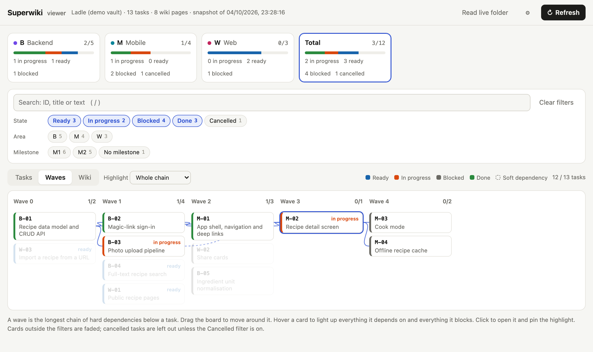

# Superwiki

Agent skills that turn a project's `docs/` folder into an **LLM-maintained wiki and task tracker**. Your coding agent writes it and keeps it current; you read it as an **Obsidian vault** or in a built-in viewer. Works with **Claude Code, Codex CLI and GitHub Copilot CLI**.

**[Live demo](https://mhmtsrfglu.github.io/superwiki/)** · [Install](#install) · [Commands](#use) · [Design notes](DESIGN.md)

<picture>
  <source media="(prefers-color-scheme: dark)" srcset="assets/viewer-waves-dark.png">
  
</picture>

```bash
npx superwiki install claude        # or: codex, copilot, global, all
```

Then, in a project: `/sw-init`.

## Why

Superwiki follows the LLM Wiki pattern described by Andrej Karpathy: raw sources you curate, a wiki the agent owns, and a short schema that tells the agent how to maintain it. On top of that it adds what a software project needs: tasks with dependencies, plans, and a record of decisions and lessons.

It is built to be cheap for the agent. One small index to read, one file per task, and a script that answers "what is ready?", "what blocks this?" or "is anything broken?" without the agent reading the vault.

Measured on a real project with 165 tasks, converted from a single markdown index:

| | Before | After |
|---|---|---|
| Read at the start of every session | 197 KB index | 94-byte catalog + 1.7 KB of rules |
| Read to start one task | the index, then the task's section | one file, 2 KB at the median |
| Marking a task done | a status cell, plus a ✅ at every reference to it (median 12 places) | one frontmatter line |

> Status: early. The CLI, the viewer, `sw-init` and the migration script are tested, and the planning flow has been run in all three agents; some skills have only been exercised once. [DESIGN.md](DESIGN.md) lists what has and has not been proven.

## What you get

```
docs/
  index.md       catalog of the wiki, one line per page
  log.md         append-only history
  raw/           your sources, never modified
  wiki/          pages the agent writes
  tasks/         one file per task (optional)
  plans/         one plan per task
  viewer.html    opened by sw-visualize, in any browser
```

`AGENTS.md` gets a short block of rules so the agent maintains the vault in every session, with or without a command.

## Install

Requires Node 18 or newer.

```bash
npx superwiki install claude
```

This copies the skills into the folder your agent reads. Name one or more targets:

| Target | Installs into | For |
|---|---|---|
| `claude` | `~/.claude/skills` | [Claude Code](#claude-code) |
| `codex` | `~/.agents/skills` | [Codex CLI](#codex-cli) |
| `copilot` | `~/.copilot/skills` | [GitHub Copilot CLI](#github-copilot-cli) |
| `global` | `~/.agents/skills` | the shared folder: Codex, Copilot CLI and [other agents](#other-agents) that read it. Claude Code does not |
| `all` | all of the above | |

```bash
npx superwiki install claude codex                   # several agents at once
npx superwiki install --project ~/code/my-app all    # one project only, not your home folder
npx superwiki uninstall claude                       # remove
npx superwiki --help
```

Start a new agent session after installing: a running session does not pick up new skills.

### From a clone

If you would rather read the code first, or want to change it:

```bash
git clone https://github.com/mhmtsrfglu/superwiki ~/.superwiki
~/.superwiki/install.sh claude            # same targets and options; links instead of copying
```

A linked install follows the clone: `git pull` updates every agent. `install.sh --copy` copies instead, `--uninstall` removes.

All three agents below were checked the same way: the agent found the skills, refused to start a task with an unfinished dependency, and ran `sw-plan` end to end with the planner subagent.

### Claude Code

```bash
npx superwiki install claude
```

Invoke with a slash: `/sw-init`, `/sw-plan T-01`.

Claude Code reads `~/.claude/skills/` (and a project's `.claude/skills/`); it does not read `~/.agents/skills/`, so `global` is not enough for it.

`sw-plan` enters plan mode when the session offers it. A model set with `sw-config` for `claude` applies to the planner and implementer subagents, written to `.claude/agents/`; if those agents are not loaded, the skills fall back to built-in agents with the same model.

### Codex CLI

```bash
npx superwiki install codex
```

Invoke with a dollar sign, or by name in a sentence: `$sw-init`, `$sw-plan T-01`, "use the sw-plan skill for T-01". Checked with CLI 0.153.

A skill cannot switch Codex into plan mode; start planning yourself with `/plan` if you want the mode, or let `sw-plan` proceed without it (it changes no file before you approve). A model set with `sw-config` for `codex` is written to `.codex/agents/sw-planner.toml` and `sw-implementer.toml`, and the skills spawn those agents by name. Subagents must be enabled (they are by default in current releases).

### GitHub Copilot CLI

```bash
npx superwiki install copilot
```

Invoke with a slash, or by name in a sentence: `/sw-init`, "use the sw-plan skill for T-01". Checked with CLI 1.0.31.

Copilot CLI also reads `~/.agents/skills/`, so if you installed `codex` or `global` it already has the skills.

A skill cannot switch Copilot into plan mode; start with `copilot --mode plan` or `/plan` if you want it. A model set with `sw-config` for `copilot` is written to `.github/agents/sw-planner.agent.md` and `sw-implementer.agent.md`; the skills dispatch them with the `task` tool. Whether Copilot honours the `model:` field of those files has not been checked.

### Other agents

```bash
npx superwiki install global
```

Agents that load `SKILL.md` folders from `~/.agents/skills` pick the skills up from there. For an agent with its own skills folder (Cursor, Gemini CLI, OpenCode and others), copy the `skills/sw-*` folders from a clone into it by hand. Nothing has been run in these agents. What will differ:

- the skills name Claude Code, Codex and Copilot tools when they dispatch subagents; elsewhere they fall back to doing the planning or implementing in the main session, and say so;
- `sw-config` writes agent files only for `claude`, `codex` and `copilot`, so a per-role model cannot be set.

Everything else (the vault, the CLI, the viewer, ingest, lint, explain, triage) depends only on Node and on the agent following the skill text.

### With other skill sets

Superwiki works next to planning skill sets such as Superpowers. Two things to know:

- Their bootstrap may claim a bare `/sw-...` prompt before Superwiki's skill loads. Naming the skill in a sentence ("use the sw-implement skill for T-02") avoids that.
- Folders they create under `docs/` are left alone: Superwiki only reads and writes `index.md`, `log.md`, `raw/`, `wiki/`, `tasks/` and `plans/`.

### Update and uninstall

```bash
npx superwiki@latest install claude      # update: same command, newest release
npx superwiki uninstall all
```

After an update, run `sw-init` again in each project: it replaces `docs/.sw/sw.mjs`, the templates and `docs/viewer.html` with the new version and keeps your content.

A project's `docs/` folder is plain markdown and keeps working as an Obsidian vault without Superwiki.

## Use

```
sw-init        set up docs/ in the current project
sw-migrate     convert an existing table-based task index, on a new git branch
sw-ingest      file a source from docs/raw/ into the wiki
sw-plan        plan a task with a planner subagent, save the approved plan
sw-implement   run a task with an implementer subagent, record the result
sw-explain     explain a task: what, why, dependencies, what it unblocks
sw-triage      for a problem: seen before? lessons, likely causes
sw-lint        structural checks by script, semantic review on request
sw-visualize   open the viewer
sw-config      models per role and tool, task areas
```

A filled-in example vault is in [examples/demo/docs](examples/demo/docs).

After that, from the project root:

```bash
node docs/.sw/sw.mjs status        # counts per area
node docs/.sw/sw.mjs ready         # tasks that can start now
node docs/.sw/sw.mjs check M-01    # what blocks this task
node docs/.sw/sw.mjs explain M-01  # its place in the dependency chain
node docs/.sw/sw.mjs search sync timeout   # where something is mentioned
node docs/.sw/sw.mjs next-id M     # next free id
node docs/.sw/sw.mjs lint          # broken links, bad frontmatter, dependency errors
node docs/.sw/sw.mjs serve --open  # the viewer, reading files live
node docs/.sw/sw.mjs snapshot      # or: freeze the vault into docs/viewer.html, no server
```

## Develop

```bash
npm test       # builds skills/sw-init/assets/sw.mjs, then runs the tests
```

`node scripts/build-demo.mjs` builds the public demo into `site/` (the viewer with the example vault baked in); the Pages workflow deploys it on every push to `main`.

`src/core.js` is shared by the CLI and the viewer. Edit sources in `src/`; the files in `skills/sw-init/assets/` named `sw.mjs` and `viewer.html` are generated.

## License

MIT
